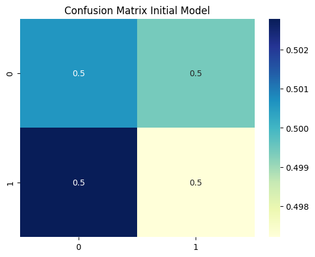

# Logistic_regression

Using a logistic regression model to classify labelled tweets by whether they were written by a bot. Dataset used for this project is from Kaggle and can be downloaded here: https://www.kaggle.com/datasets/goyaladi/twitter-bot-detection-dataset.
